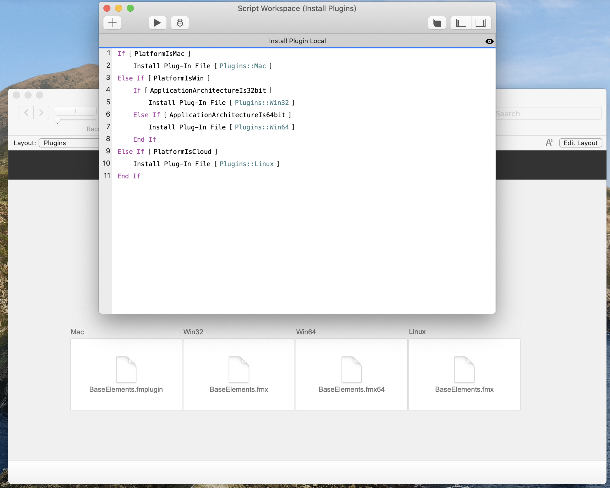
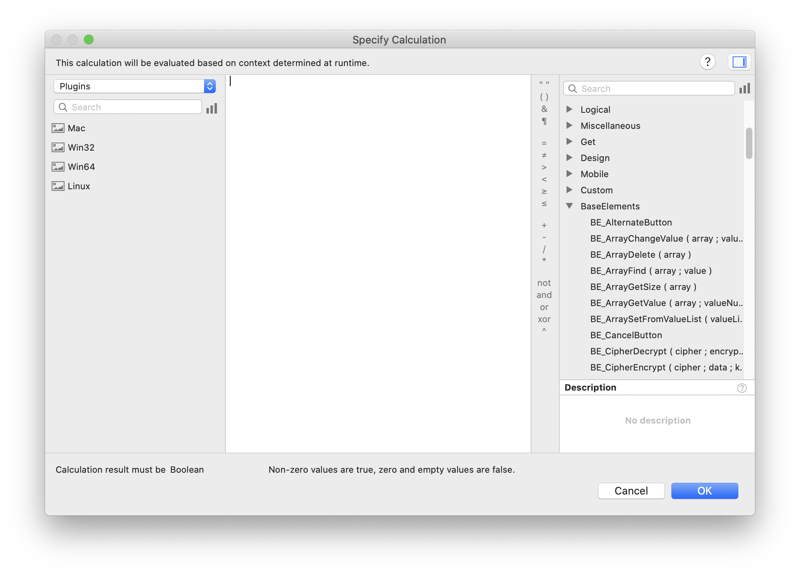
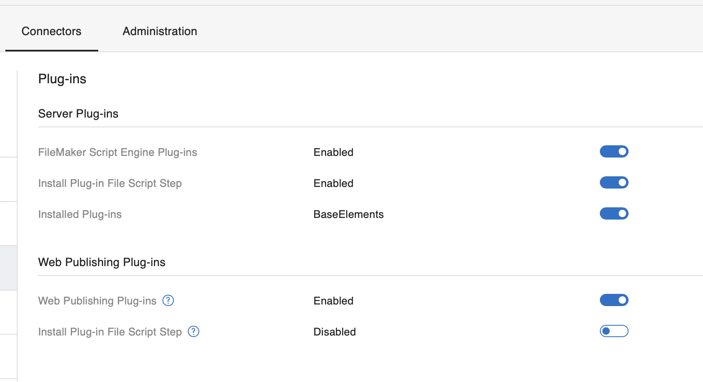
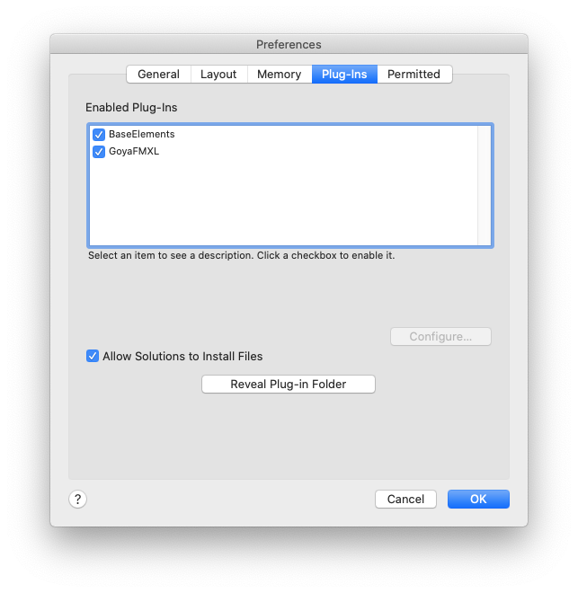

## How to install the BaseElements Plugin

You've downloaded the plugin file, and got a .fmx64 or a .fmplugin file, now what do you do?

**Server vs Client installs**

The first thing to understand is the difference between a server and client install.  You can install plugin on FileMaker Server - this does not do anything for FileMaker clients being able to use plugin functions locally though.  Each FileMaker Pro client will need to have a copy of the plugin installed locally for them to be able to use plugin functions inside scripts and calculations that run on the client.

Each FileMaker Pro client with a different OS needs a different plugin - so there are different files for Mac vs Windows for example.  And some behaviours, especially around file paths, will be different on each platform.

There's also different locations on server for different functionality, so a plugin that does a calculation that displays in WebDirect will need to be installed for that, and will be a different location than one for Perform Script on Server scripts.

Also when you use plugin functions inside stored calculation fields, these can often be evaluated on the server, so the plugin needs to be installed there too.

### Recommended : Scripted Installation for Client or Server

The scripted install is the best way to keep plugins up to date on any system that is being used constantly and where you want to check that the plugin is active before you let a user do tasks that require the plugin.  You can use a script that runs via the On First Window Open trigger, to check for the latest version and install it if required.

If you're starting from scratch to build this yourself, it's not complex, but there are a few steps.

Create a FileMaker file ( or use a table in an existing file, or create a new table) with container fields to store all of the versions of the plugin you need to install.  So one for Win32, Win64, Mac and Linux, or only one if you are only ever on a single platform.  This could be a single record Plugins table you create just for this purpose, or could be global fields that you set in the file when it's not hosted.

All of the scripted methods require that the BaseElements plugin is first inside a FileMaker container field.

### Getting the Plugin into a container field

The easiest way is to drag and drop the plugins into corresponding container fields, one for each platform.  However, you can't unzip the Mac plugin on Windows or Linux and have it still work on the Mac.  You either need to unzip and copy from a Mac or download the .gz version from the web, directly into a container field :

**Installing a plugin direct from the web or from disk**

The plugins are provided as .zip files for ease of download and decompression on all platforms.  However, all versions are also available as .gz versions which are files that can be inserted into a container field via an Insert From URL step, and will be auto de-compressed by FileMaker automatically.  This has the advantage that you can download the Mac BaseElements.fmplugin.gz plugin on Windows, and have it decompress into a working uncompressed bundle inside FileMaker Pro.

You need to have a file with container fields, and then run a script to do Insert From URL and set the container field where you want to store the plugin file.

You can install the BE plugin direct from the .gz urls linked on this site. However we don't recommend you do that, and suggest instead you download and test them, validate that they meet your needs and don't contain any unwanted code ( hard to do ) and then copy the gz files to a location that you own and manage.

You can also use a file link if you've downloaded to your computer.  Example file urls would be :

    file:///Users/nick/Desktop/BaseElements.fmplugin.gz
    file:///c:/BaseElements.fmplugin.gz

**Back to Scripted Install**

Create a script that checks what version of the plugin is installed via the **BE_VersionAutoUpdate** function, and then uses the **Install Plug-in File script step** to install the right plugin for each platform if required.   This script could be called on startup, or just prior to any plugin action that is being done.

**Note** : We recommend the **BE_VersionAutoUpdate** function because when converted to a number, you can compare the result using > and < and it will always work.  This won't be the case for **BE_Version** where a 4.0.10 is ( in maths terms ) less than 4.0.2 when in fact the .10 version is newer.  **BE_Version** is just for human readable display.

## How do I automatically check if the plugin is installed in FileMaker?

When you're running a script that requires a plugin, always check via the BE_VersionAutoUpdate functions, and check for a specific version.

If you've done a plugin install, **after the install check the BE_VersionAutoUpdate every time** - there are issue with some FileMaker versions where a plugin install reports a success, but the old version is still loaded - the fix is a restart, either of FileMaker Pro or FileMaker Server.You'll also know when the plugin isn't installed because calls to plugin functions return ? and you should always be trapping for ? in function call response as part of your error trapping in your scripting.

## What do I do if the plugin doesn't install via script?

We've seen reports of lots of different versions of FileMaker Pro or FileMaker Server where the plugin fails to install properly via script, or when installed it reports no error, but the plugin either doesn't work, or the previous old version is still installed.  This seems to occur only when trying to update an older plugin or to re-install to confirm the scripted process is working.

Unfortunately this seems to be a FileMaker error as it occurs with plugins other than the BaseElements plugin, and we've submitted bug reports to Claris about it.  If you experience this issue, please add to the comments and upvote this issue on the Claris Community :

[Plugins don't update](https://community.claris.com/en/s/question/0D53w000059nwXYCAY/plugins-dont-update-depending-on-location)

If a restart of either FileMaker Pro, or of the FileMaker Server engine ( fmsadmin restart fmse or cwp ), it seems that the only real fix for this is to manually remove any plugins and then repeat the scripted install.  Installing BE via script when not overwriting an older plugin seems to work successfully.

## How do I manually check if the BaseElements plugin is installed in FileMaker Pro?

There are two places to check : in the FileMaker Application Preferences dialog, as per the above, and in the Calculation Editor dialog box, as per the screenshot below.

**Note : there are NO BaseElements Plugin Script steps, so it won't add any steps to the Script Editor, BaseElements only adds Functions to the calculation editor. **

## How do I manually check that the plugin is installed on FileMaker Server?

As of FileMaker Server 19, you can only show plugins installed in FMSE, not in Web Publishing.  The only way to know that a plugin is active in Web Publishing is to run a script that uses it.

Open the FMS Admin for the server, go to the Connectors tab, and to the Plugins section.  As you can see in the screen shot below, I can install plugins via script in FMSE, but not in WPE.  Plugins are enabled in both, and the FMSE engine lists on plugin that is installed, and it's active.

## Manual Installation in FileMaker Pro Client

Open the FileMaker application preferences, and go to the plugins tab.  You'll see a dialog much like this one :

Click on the **Reveal Plug-in Folder** button at the bottom of that window.  That will open a folder that you can copy the BaseElements plugin file into.

Restart FileMaker Pro, and when you re-open the dialog, BaseElements should appear in the list like the one above.

**Note** : We don't recommend you install plugins this way, there can be issues with permissions or compatibility, or issues arising from other applications interfering with the plugin files on disk - we recommend you use the script install above.  However, access to this folder is useful for removing old plugins when there are any update or install issues.

Manual Installation on FileMaker ServerIn order for plugin functions to work in scripts that are run via Perform Script on Server or in scheduled scripts, you also need to install the plugin in FileMaker Server.

We highly recommend installing via a script, as per the, but you can also install manually.  You need to be aware of :

There are three different platforms, and two different locations for plugins on server.  See here :

[https://help.claris.com/en/server-help/content/plugins-script-step.html](https://help.claris.com/en/server-help/content/plugins-script-step.html)

Copying files to some servers ( like headless linux boxes ) is not simple and will vary across setups.

Copying files with folders ( like linux or Mac ) can have permissions complications that render plugins unable to work.

So if you're needing plugins to run server side, we highly recommend you use scripted installs, and check at the start of every script run that the plugin you require is installed.
